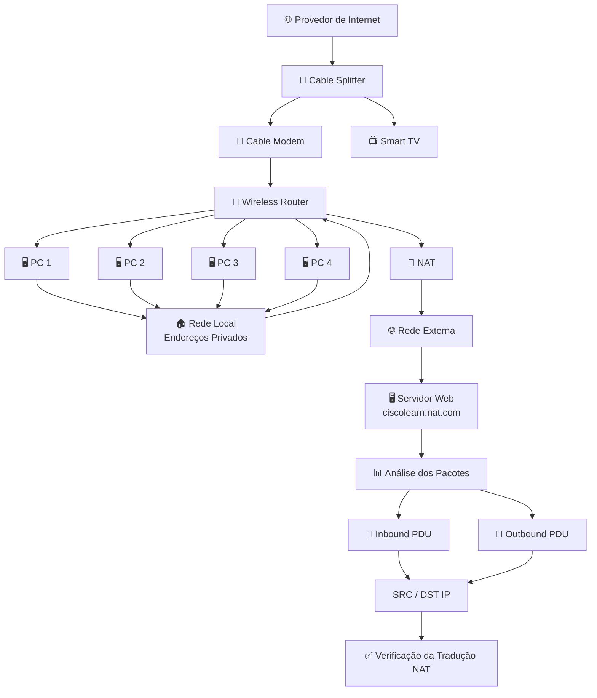
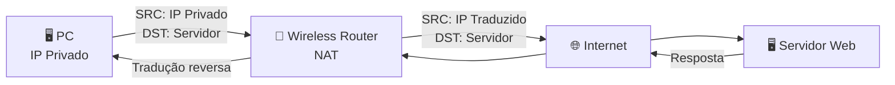

````markdown
# 🏠 Configure a Wireless Router and Client

> **Cisco Packet Tracer Lab**
>
> **Autor:** Jordão Paulo  
> **Categoria:** Redes de Computadores • Cisco Packet Tracer • Cisco Networking Academy (NetAcad)  
> **Nível:** Iniciante

---

# 📖 Descrição

Este laboratório simula a implementação e análise de uma **rede doméstica (Home Network)** utilizando o **Cisco Packet Tracer**, permitindo compreender como diferentes dispositivos compartilham a mesma infraestrutura de rede por meio de um **Wireless Router**.

A residência recebe o sinal do provedor de Internet através de um **Cable Splitter**, responsável por dividir o sinal coaxial em duas saídas: uma destinada ao **Cable Modem**, que fornece acesso à Internet ao roteador, e outra destinada à **Smart TV**, permitindo a recepção do sinal de televisão via cabo coaxial.

Após receber a conexão do Cable Modem, o **Wireless Router** distribui a conectividade para os dispositivos da rede local e executa funções importantes como **DHCP, NAT e WLAN**.

Além da rede doméstica, o cenário também inclui um **Servidor Web Externo**, utilizado para validar a comunicação entre a rede local e um serviço Web localizado na Internet.

Durante este laboratório serão abordados conceitos fundamentais de Redes de Computadores, incluindo:

- Configuração de redes sem fio;
- DHCP;
- Endereçamento IPv4;
- Redes privadas e públicas;
- Gateway padrão;
- NAT (Network Address Translation);
- Comunicação entre redes internas e externas;
- HTTP;
- Análise de tráfego no Cisco Packet Tracer;
- Simulação de pacotes;
- Análise dos cabeçalhos dos pacotes;
- Testes de conectividade.

---

# 🎯 Objetivos

Ao concluir este laboratório, o estudante será capaz de:

- Configurar um Wireless Router;
- Configurar uma rede Wireless (Wi-Fi);
- Compreender o funcionamento do DHCP;
- Configurar clientes da rede;
- Identificar endereços IPv4 privados e públicos;
- Examinar a configuração NAT de um Wireless Router;
- Configurar 4 PCs para obter endereços IP via DHCP;
- Validar a comunicação entre dispositivos;
- Observar o tráfego que atravessa o roteador utilizando NAT;
- Analisar os cabeçalhos dos pacotes;
- Identificar a alteração do endereço IP de origem durante a tradução NAT;
- Testar o acesso a um servidor Web externo;
- Entender a arquitetura de uma rede doméstica.

---

# 🏡 Arquitetura da Rede

```mermaid
flowchart TB

    ISP["🌐 Internet / ISP"]

    WEB["🖥️ Servidor Web Externo<br/>ciscolearn.nat.com"]

    SPLITTER["📡 Cable Splitter"]

    MODEM["📶 Cable Modem"]

    TV["📺 Smart TV"]

    ROUTER["📡 Wireless Router<br/><br/>DHCP • NAT • WLAN<br/>Gateway da Rede"]

    PC1["🖥️ PC 1"]
    PC2["🖥️ PC 2"]
    PC3["🖥️ PC 3"]
    PC4["🖥️ PC 4"]

    ISP --> WEB
    ISP --> SPLITTER

    SPLITTER --> MODEM
    SPLITTER --> TV

    MODEM --> ROUTER

    ROUTER --> PC1
    ROUTER --> PC2
    ROUTER --> PC3
    ROUTER --> PC4

    PC1 -. "LAN / IP Privado" .-> ROUTER
    PC2 -. "LAN / IP Privado" .-> ROUTER
    PC3 -. "LAN / IP Privado" .-> ROUTER
    PC4 -. "LAN / IP Privado" .-> ROUTER

    ROUTER == "NAT" ==> WEB
````

---

# 🏠 Estrutura do Laboratório

## 🛋️ Sala (Living Room)

**Equipamentos:**

* Smart TV
* Laptop

---

## 🛏️ Quarto (Bedroom)

**Equipamentos:**

* Desktop PC

---

## 🖥️ Escritório (Home Office)

### Infraestrutura de Rede

* Cable Splitter
* Cable Modem
* Wireless Router

### Dispositivos

* Desktop PC
* Laptop
* PCs utilizados para análise do NAT

---

## 🌐 Infraestrutura Externa

### Internet

* Servidor Web Externo

  * Website: **skillsforall.srv**
  * Servidor utilizado para testar a comunicação entre a rede interna e a rede externa.

---

# 📦 Inventário de Equipamentos

| Equipamento          | Quantidade | Função                                                      |
| -------------------- | ---------: | ----------------------------------------------------------- |
| Cable Splitter       |          1 | Divide o sinal coaxial entre o Cable Modem e a Smart TV     |
| Cable Modem          |          1 | Converte o sinal coaxial em Ethernet para acesso à Internet |
| Wireless Router      |          1 | Gateway da rede, NAT, DHCP e Access Point                   |
| Desktop PC           |          2 | Clientes da rede                                            |
| Laptop               |          2 | Clientes da rede                                            |
| PCs adicionais       |          4 | Clientes utilizados na análise do NAT                       |
| Smart TV             |          1 | Recebe sinal coaxial e integra-se ao cenário da rede        |
| Servidor Web Externo |          1 | Hospeda o serviço Web utilizado nos testes                  |

---

# 🌐 Tecnologias Utilizadas

* Cisco Packet Tracer
* IPv4
* Ethernet
* Cabo Coaxial
* IEEE 802.11 (Wi-Fi)
* DHCP
* NAT
* HTTP
* DNS
* Wireless LAN (WLAN)
* Simulation Mode
* Complex PDU
* TCP

---

# ⚙️ Configurações Realizadas

Durante este laboratório serão realizadas as seguintes atividades:

* Configuração do Wireless Router;
* Configuração do SSID (Nome da Rede);
* Configuração da senha da rede Wi-Fi;
* Configuração do serviço DHCP;
* Associação dos dispositivos à rede;
* Obtenção automática de endereços IP;
* Identificação do Gateway padrão;
* Análise do endereço IP da interface Internet;
* Análise do endereço IP da rede local;
* Análise da faixa de endereços fornecida pelo DHCP;
* Identificação de endereços privados e públicos;
* Configuração de 4 PCs;
* Verificação das configurações IPv4 utilizando `ipconfig /all`;
* Criação de tráfego HTTP;
* Observação da tradução NAT;
* Análise dos cabeçalhos dos pacotes;
* Testes de comunicação com servidor Web externo.

---

# 🔄 Fluxo da Comunicação e NAT

```mermaid
flowchart LR

    PC["🖥️ PC<br/>IP Privado"]

    LAN["🏠 Rede Local<br/>Endereço Privado"]

    NAT["📡 Wireless Router<br/>NAT"]

    WAN["🌐 Interface Internet<br/>Endereço Público"]

    SERVER["🖥️ Web Server<br/>ciscolearn.nat.com"]

    PC -->|"HTTP Request<br/>SRC: IP Privado"| LAN

    LAN --> NAT

    NAT -->|"NAT Translation<br/>SRC: IP Público"| WAN

    WAN --> SERVER

    SERVER -->|"HTTP Response"| WAN

    WAN --> NAT

    NAT -->|"Reverse NAT"| LAN

    LAN --> PC
```

---

# 🧪 Packet Tracer - Examine NAT on a Wireless Router

## 🎯 Objectives

* Examine NAT configuration on a wireless router;
* Set up 4 PCs to connect to a wireless router using DHCP;
* Examine traffic that crosses the network using NAT.

---

# 🧪 Part 1: Examine the Configuration for Accessing the External Network

### a. Adicionar o primeiro PC

Adicione 1 PC e conecte-o ao **Wireless Router** utilizando um **cabo straight-through**.

Aguarde até que todos os indicadores de link fiquem verdes antes de prosseguir.

Também é possível utilizar a opção **Fast Forward** para acelerar a convergência da rede.

---

### b. Configurar o PC para utilizar DHCP

No PC:

**Desktop → IP Configuration → DHCP**

A opção DHCP permite que o dispositivo receba automaticamente um endereço IP fornecido pelo servidor DHCP existente no Wireless Router.

---

### c. Identificar o Default Gateway

Na configuração IPv4 do PC, observe o endereço definido como:

**Default Gateway**

Anote esse endereço.

O Gateway padrão representa o endereço utilizado pelo PC para encaminhar tráfego destinado a redes externas.

---

### d. Acessar a interface Web do Wireless Router

Abra o navegador Web do PC e introduza o endereço IP do **Default Gateway** no campo de URL.

Quando solicitado, utilize:

* **Username:** `admin`
* **Password:** `admin`

---

### e. Acessar o Status do roteador

Na interface Web do Wireless Router:

**Status → Router**

Essa seção apresenta informações relacionadas à configuração do roteador.

---

### f. Examinar a conexão com a Internet

Localize a seção:

**Internet Connection**

O endereço IP apresentado nessa área corresponde ao endereço atribuído à interface de Internet do Wireless Router pelo ISP.

Caso apareça:

`0.0.0.0`

aguarde alguns segundos e atualize a página.

O roteador pode ainda estar aguardando a atribuição de um endereço IP através do DHCP do ISP.

### ❓ Pergunta

**O endereço IP apresentado na interface Internet é privado ou público?**

---

# 🧪 Part 2: Examine as Configurações para Acessar a Rede Interna

### a. Acessar Local Network

Na barra de opções do menu **Status**, selecione:

**Local Network**

---

### b. Examinar as informações da rede local

Observe as informações apresentadas na seção **Local Network**.

Esse endereço representa a rede interna utilizada pelos dispositivos conectados ao Wireless Router.

---

### c. Examinar o servidor DHCP

Desça na página e localize as informações referentes ao:

**DHCP Server**

Observe:

* Endereço da rede;
* Endereço inicial;
* Endereço final;
* Faixa de endereços que podem ser atribuídos aos hosts.

### ❓ Pergunta

**Os endereços utilizados na rede interna são privados ou públicos?**

---

### d. Fechar a configuração

Após concluir a análise, feche a janela de configuração do Wireless Router.

---

# 🧪 Part 3: Connect 3 PCs to the Wireless Router

### a. Adicionar os PCs

Adicione **3 PCs adicionais** e conecte-os ao Wireless Router utilizando **cabos straight-through**.

Aguarde até que os indicadores de link fiquem verdes ou utilize **Fast Forward**.

---

### b. Configurar DHCP nos PCs

Em cada PC:

**Desktop → IP Configuration → DHCP**

Cada dispositivo deverá receber automaticamente um endereço IP através do servidor DHCP do Wireless Router.

Após receber o endereço, feche a janela **IP Configuration**.

---

### c. Verificar a configuração IPv4

Em cada PC:

**Desktop → Command Prompt**

Execute:

```bash
ipconfig /all
```

Verifique:

* IPv4 Address;
* Subnet Mask;
* Default Gateway;
* DHCP Server;
* DNS Server.

### ⚠️ Nota

Os dispositivos da rede interna receberão **endereços IP privados**.

Endereços privados não podem atravessar diretamente a Internet.

Por isso, quando um dispositivo interno precisa acessar uma rede externa, é necessário que ocorra uma **tradução NAT** no Wireless Router.

---

# 🧪 Part 4: View NAT Translation Across the Wireless Router

## a. Entrar no Simulation Mode

Clique na aba:

**Simulation**

A aba está localizada na parte inferior direita da janela do Cisco Packet Tracer, próxima da opção **Realtime**.

O Simulation Mode permite observar o processamento dos pacotes passo a passo.

---

## b. Criar tráfego utilizando um Complex PDU

### 1. Configurar os filtros de eventos

No **Simulation Panel**:

1. Clique em **Show All/None** para desmarcar os eventos;
2. Clique em **Edit Filters**;
3. Acesse a aba **Misc**;
4. Marque:

   * **TCP**
   * **HTTP**
5. Feche a janela.

---

### 2. Criar um Complex PDU

Clique no ícone de envelope aberto localizado no menu superior.

---

### 3. Definir o dispositivo de origem

Clique em um dos PCs para especificá-lo como:

**Source Device**

---

## c. Configurar o Complex PDU

Na janela **Create Complex PDU**, configure:

### PDU Settings

**Application:**

```text
HTTP
```

### Destination

Selecione o servidor:

```text
ciscolearn.nat.com
```

### Source Port

Configure:

```text
1000
```

### Simulation Settings

Selecione:

```text
Periodic
```

Defina o intervalo:

```text
120 seconds
```

Por fim, clique em:

**Create PDU**

---

## d. Liberar o Simulation Panel

Clique duas vezes no **Simulation Panel** para desbloqueá-lo da janela principal do Packet Tracer.

Isso permite mover o painel e visualizar simultaneamente toda a topologia da rede.

---

## e. Observar o fluxo do tráfego

Clique em:

**Play**

no Simulation Panel.

Para acelerar a animação, mova o controle de velocidade para a direita.

### ⚠️ Nota

Quando aparecer a mensagem:

**Buffer Full**

clique em:

**View Previous Events**

para continuar analisando os eventos anteriores.

---

# 🧪 Part 5: View the Header Information of the Packets

## a. Examinar os cabeçalhos dos pacotes

Observe os pacotes enviados entre o PC e o servidor Web.

No **Simulation Panel**:

1. Localize a lista de eventos;
2. Clique duas vezes na **3ª linha** da lista;
3. Um envelope representando o evento será apresentado na área de trabalho;
4. Clique no envelope para visualizar as informações do pacote.

---

## b. Examinar o Inbound PDU

Selecione:

**Inbound PDU Details**

Examine as informações do pacote.

Observe principalmente:

* **SRC IP Address**
* **Destination IP Address**

---

## c. Examinar o Outbound PDU

Selecione:

**Outbound PDU Details**

Observe novamente:

* **SRC IP Address**
* **Destination IP Address**

### 🔎 Observação importante

Será possível observar uma alteração no:

**SRC IP Address**

Essa alteração representa o processo de **Network Address Translation (NAT)** realizado pelo Wireless Router.

---

## d. Examinar outros eventos

Clique em diferentes linhas da lista de eventos para acompanhar os cabeçalhos dos pacotes durante todo o processo de comunicação.

Observe como as informações do pacote podem mudar à medida que ele atravessa o Wireless Router.

---

## e. Verificar os resultados

Quando terminar a atividade, clique em:

**Check Results**

para verificar o resultado do laboratório.

---

# 🔄 Fluxo do Laboratório



---

# 🧪 Testes Realizados

Após a configuração, recomenda-se validar:

* ✅ Comunicação entre os Desktop PCs;
* ✅ Comunicação entre os Laptops;
* ✅ Conectividade da Smart TV;
* ✅ Recebimento automático de endereços IP via DHCP;
* ✅ Comunicação com o Gateway;
* ✅ Identificação do endereço IP da interface Internet;
* ✅ Identificação da rede interna;
* ✅ Identificação da faixa DHCP;
* ✅ Identificação de endereços privados;
* ✅ Identificação de endereços públicos;
* ✅ Acesso ao servidor Web externo;
* ✅ Geração de tráfego HTTP;
* ✅ Visualização do tráfego no Simulation Mode;
* ✅ Análise dos cabeçalhos dos pacotes;
* ✅ Observação da alteração do endereço IP de origem;
* ✅ Validação da tradução NAT;
* ✅ Comunicação entre os dispositivos da LAN e a rede externa.

---

# 📚 Conceitos Abordados

* Redes Domésticas
* Topologias de Rede
* Cabo Coaxial
* Ethernet
* Wireless LAN (WLAN)
* DHCP
* Gateway Padrão
* NAT
* Network Address Translation
* Endereços IPv4 Privados
* Endereços IPv4 Públicos
* DNS
* HTTP
* TCP
* Wireless Router
* Internet
* ISP
* Simulation Mode
* Complex PDU
* PDU Details
* Cabeçalhos de Pacotes
* Cisco Packet Tracer
* Cisco Networking Academy

---

# 📌 Pré-requisitos

* Cisco Packet Tracer instalado;
* Conhecimentos básicos de Redes de Computadores;
* Conceitos básicos de IPv4;
* Noções de redes Wireless;
* Conhecimentos básicos de DHCP;
* Conhecimentos introdutórios sobre NAT.

---

# 🎓 Competências Desenvolvidas

Ao concluir este laboratório, o estudante desenvolverá competências em:

* Configuração de Roteadores Wireless;
* Administração de Redes Domésticas;
* Configuração de Clientes de Rede;
* Configuração automática de endereços IPv4;
* Análise de DHCP;
* Identificação de endereços privados e públicos;
* Compreensão do funcionamento do NAT;
* Análise de tráfego de rede;
* Utilização do Simulation Mode;
* Criação de Complex PDU;
* Análise de cabeçalhos de pacotes;
* Testes de conectividade;
* Diagnóstico de Problemas de Conectividade;
* Simulação de Redes Cisco.

---

# 🔍 Conceito Fundamental: NAT

O **Network Address Translation (NAT)** permite que dispositivos que utilizam endereços IPv4 privados comuniquem-se com redes externas através da tradução desses endereços.

No cenário deste laboratório:



O processo pode ser representado conceitualmente como:

```text
Host interno
     │
     │ IP privado
     ▼
Wireless Router
     │
     │ NAT
     ▼
Endereço traduzido
     │
     ▼
Internet
     │
     ▼
Servidor Web
```

---

# ✅ Resultado Esperado

Ao final do laboratório:

* O **Cable Splitter** deverá distribuir corretamente o sinal coaxial;
* O **Cable Modem** deverá fornecer conectividade ao Wireless Router;
* O Wireless Router deverá possuir uma interface voltada para a rede externa;
* A rede interna deverá utilizar endereços IPv4 privados;
* Os PCs deverão obter automaticamente seus endereços através do DHCP;
* Os dispositivos deverão utilizar o Wireless Router como Gateway padrão;
* O tráfego destinado à rede externa deverá atravessar o Wireless Router;
* O Wireless Router deverá realizar a tradução NAT;
* O endereço IP de origem deverá apresentar alteração durante o processo de tradução;
* O tráfego HTTP deverá ser observado no **Simulation Mode**;
* Os cabeçalhos **Inbound PDU** e **Outbound PDU** deverão permitir observar o processo;
* Os PCs deverão conseguir comunicar-se com o servidor Web externo;
* A atividade deverá ser concluída com sucesso através da opção **Check Results**.

---

# 👨‍💻 Autor

**Jordão Paulo**

**Analista de Cibersegurança** • **Analista de Redes** • **Infraestrutura de TI**

Criador da série **Laboratórios Cisco NetAcad**, dedicada ao ensino prático de Redes de Computadores, Infraestrutura de TI e Cibersegurança utilizando o Cisco Packet Tracer.

---

© 2026 Jordão Paulo. Todos os direitos reservados.

```
```
